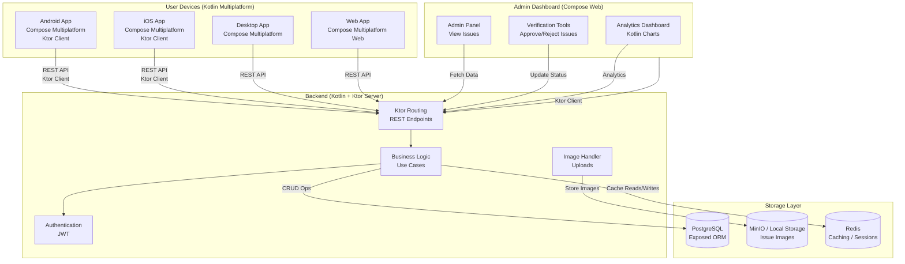

# 🌍 **GreenGuardian**  
### *A Fully Kotlin-Based Cross-Platform Environmental Issue Reporting Application*

---

## 📌 **Problem Statement**

Environmental issues—such as illegal dumping, plastic pollution, forest damage, water contamination, and improper waste disposal—often go unreported due to **lack of accessible reporting systems**.  
Citizens witness problems but don’t know **where** or **how** to report them.

Governments and NGOs also lack **real-time environmental data**, making problem-solving slower and less efficient.

**GreenGuardian** empowers every citizen to become an environmental protector by providing a simple, unified platform for reporting, mapping, and tracking environmental issues.

---

## 🌱 **Project Overview**

**GreenGuardian** is a **100% Kotlin-based cross-platform application** that lets users:

- 📸 Report environmental issues with images  
- 📍 Automatically attach GPS location  
- 🗺️ View issues on an interactive map  
- 🧭 Track status (submitted → verified → resolved)  
- 📊 Generate analytics for authorities/NGOs  
- 👥 Boost community participation in protecting the planet  

No matter the device — **Android, iOS, Desktop, or Web** — the experience remains the same thanks to Kotlin Multiplatform.

---

## 💥 **Impact on Society**

### ✔️ Rapid environmental response  
Local bodies and NGOs get real-time, structured reports.

### ✔️ Community empowerment  
Every user becomes an environmental guardian.

### ✔️ Cleaner, healthier public spaces  
Faster detection means faster resolution.

### ✔️ Data-driven policy creation  
Environmental heatmaps help stakeholders take action.

### ✔️ Better transparency  
Users can track issue progress and government action.

### ✔️ Encourages a sustainable mindset  
Strengthens public responsibility toward the environment.

---

## 🛠️ **Tech Stack (Only Kotlin)**

### **📱 Cross-Platform Application (Frontend)**
- **Kotlin Multiplatform (KMP)**
- **Compose Multiplatform** (Android, iOS, Desktop, Web)
- **Ktor Client** (networking)
- **SQLDelight** (local storage)
- **Kotlinx Serialization**
- **MapLibre GL for Kotlin** (maps)
- **Koin / Kodein** for DI

### **🌐 Backend (All Kotlin)**
- **Ktor Server**
- **Kotlin Coroutines**
- **Exposed ORM**
- **PostgreSQL** (Issue & User Database)
- **Kotlinx Serialization**
- **Image Storage:**  
  - MinIO (S3-compatible)  
  - or Local Storage (during development)
- **JWT Authentication (Kotlin-only)**

### **💻 Admin Dashboard (Kotlin Web)**
- **Compose Multiplatform for Web**
- **Ktor Client**
- **Kotlinx HTML**

### **☁️ DevOps / Deployment**
- **Docker (Kotlin + JVM images)**
- **NGINX Reverse Proxy**
- **Ktor Engine (Netty / CIO)**
- **GitHub Actions (Kotlin builds)**

---

## 🚀 **Features Roadmap**

- [ ] Capture & report environmental issues  
- [ ] GPS-based auto location tagging  
- [ ] Map view for issues  
- [ ] Issue verification workflow  
- [ ] Admin dashboard  
- [ ] Status tracking for users  
- [ ] Notifications (Firebase + Kotlin)  
- [ ] Analytics dashboard  
- [ ] Dark/Light themes with Compose  

---

## 🤝 **Contributing**

Anyone with Kotlin experience is welcome to contribute.  
Needed help in:
- UI/UX (Compose)
- Kotlin backend (Ktor)
- Database modeling (Exposed)
- Maps integration (MapLibre)
- Documentation & testing

---

## 📜 **License**

MIT License — fully open for modification and distribution.

